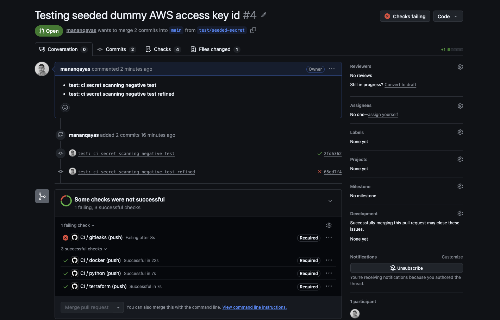

# Paved-Road DevSecOps Pipeline
A reusable, opinionated CI/CD pipeline ("paved road") that any service team can adopt.

Security is built into the road, not bolted on: every PR gets secret scanning, SAST, IaC scanning, image scanning, keyless signing, and SBOM attestation with policy gates that fail the build on severity thresholds.

## Problem

Service teams ship fast and security reviews don't scale. Without a paved road, every team reinvents scanning, gates are advisory-only, and "we'll fix it later" becomes the vulnerability backlog. The result: secrets in git history, known-CVE base image in prod, unsigned artifacts nobody can verify.

## Architecture
```
                 ┌──────────────────────────────────────────────────┐
                 │                   GitHub PR                      │
                 └───────────────┬──────────────────────────────────┘
                                 ▼
              ┌──────────────────────────────────────┐
              │            GitHub Actions            │
              │  ┌─────────┐ ┌────────┐ ┌──────────┐ │
   Phase 2.0  │  │Gitleaks │ │Semgrep │ │  Checkov │ │  Phase 3.0
              │  │(secrets)│ │(SAST)  │ │  (IaC)   │ │
              │  └─────────┘ └────────┘ └──────────┘ │
              │  ┌─────────┐ ┌───────────────────┐   │
              │  │ Trivy   │ │ Cosign + SBOM     │   │  Phase 4.0
              │  │(fs+image│ │ (keyless sign,    │   │
              │  │ +SARIF) │ │  attest)          │   │
              │  └─────────┘ └───────────────────┘   │
              └───────────────┬──────────────────────┘
                              ▼  fail on HIGH/CRITICAL or secret hit
                 ┌────────────────────────┐
                 │  Signed image + SBOM   │  verify.sh proves it
                 └────────────────────────┘
```
**Phase 2. (this phase):** Automated code scanning job for secrets on every code commit and PR. Static Application Security Testing (SAST) CI job using Semgrep implementing custom [CWE Top 25 rules](https://cwe.mitre.org/top25/archive/2025/2025_cwe_top25.html).

+ baseline Actions workflow (python test, docker build, terraform fmt/validate)
+ branch protection (0 reviewers for solo setup)
+ secrets scanning ci job using gitleaks
+ Static Application Security Testing using Semgrep


## Threat model
| Threat | Phase 2.0 posture | Paved-road mitigation (later phases) |
| --- | --- | --- |
| Secret commited to git | Blocked at PR | Gitleaks CI, blocks PR|
| Vulnerable app code merged | SAST `CRITICAL VULN` blocks at PR | Semgrep SAST + 25 custom rules, blocks PR |
| Insecure infra merged | `fmt`/`validate` only | Checkov IaC scan, blocks on HIGH/CRITICAL (3.0) |
| CVE in base image / deps | No scanning | Trivy  |
| Tampered image deployed | Unsigned | Cosign keyless (OIDC) signing, `verify.sh` (4.0) |
| Unknown what's inside image | No inventory | SBOM per image, attached as attestation (4.0) |


## What was built (Phase 1.0)

- `app/` – FastAPI sample API (`/healthz`, `/hello`), pytest suite (3 tests)
- `Dockerfile` – `python:3.12-slim`, non-root `appuser` (uid 10001), healthcheck
- `terraform/` – null provider, zero-cost placeholder; `fmt`/`validate` in CI
- `.github/workflows/ci.yml` – three jobs: `python` (Checkout code/Install uv and Python/Install dependencies/Lint/Run tests), `docker` (Checkout code/Build docker image), `terraform` (Checkout code/Terraform format/Terraform init and validate)
- Branch protection: `main` requires PR + passing `ci` (setup script below)

## What was built (Phase 2.0)

- gitleaks ci job
- SAST ci job + CWE Top 25 Application Security Vulnerabilities Custom Rules using Semgrep
- Semgrep rules cover OWASP Top 10 security vulnerabilites like XSS, SQLi, CSRF, Missing Authorization etc

## Reproduce in one command

```bash
gitleaks git    # locally runs gitleaks in the repo for secrets scanning
```
```bash
semgrep --test semgrep/rules    # locally unit tests the semgrep rules
```
```bash
semgrep scan \
    --config semgrep/rules/cwe-top25-rules.yml \
    --metrics=off \
    --json \
    --output semgrep-results.json
```
```bash
make all    # install + pytest + compile check (no docker/terraform needed)
```

Full local parity (needs docker + terraform)

``` bash
make install && make test && make docker-build && make tf-validate
```

CI runs the same on every push/PR to `main`

## Verification

**Done-gate for Phase 1.0:** green pipeline on clean code.

- [x] `make all` passes locally (output pasted below)
- [X] `gh` push to new repo shows all three CI jobs green on `main`
- [x] Branch protection on `main`: require PR, require `ci` status checks, dismiss stale approvals (commands below)
- [x] Negative test (reserved for Phase 2.0): seeded secret must FAIL the pipeline – not applicable yet, no scanners wired

Local verification output (Phase 1.0) – run 2026-10-03:

```
uv run ruff check
All checks passed!
Phase 1.0 local checks passed.
```

Docker build + Terraform fmt/validate need docker/terraform binaries – they run in CI (ubuntu-latest) on every push/PR.

**Done-gate for Phase 2.0:** green pipeline on clean, secrets free and secure code.

- [x] `gitleaks git` passes locally and PR is blocked when code contains a secret (output below)
- [x] `semgrep --test semgrep/rules` runs tests for CWE top 25 custom rules successfully (output below)
- [x] `semgrep scan --config semgrep/rules/cwe-top25-rules.yml app` tests code locally against the custom rules defined for critical vulnerabilities (output below)

**gitleaks result**

```
    ○
    │╲
    │ ○
    ○ ░
    ░    gitleaks

11:00PM INF 20 commits scanned.
11:00PM INF scanned ~304218 bytes (304.22 KB) in 186ms
11:00PM WRN leaks found: 1

```
**Semgrep tests result**
```
25/25: ✓ All tests passed
No tests for fixes found.
```

**Semgrep scan result (FAILED)**
```
┌──── ○○○ ────┐
│ Semgrep CLI │
└─────────────┘

Scanning 1 file (only git-tracked) with 25 Code rules:

  CODE RULES
  Scanning 1 file with 25 python rules.

  SUPPLY CHAIN RULES

  No rules to run.


  PROGRESS

  ━━━━━━━━━━━━━━━━━━━━━━━━━━━━━━━━━━━━━━━━ 100% 0:00:00


┌────────────────┐
│ 1 Code Finding │
└────────────────┘

    app/main.py
   ❯❯❱ semgrep.rules.python.cwe94.dynamic-code-execution
          ❰❰ Blocking ❱❱
          CWE-94: Dynamic code execution is forbidden in the API runtime. Replace eval/exec/compile of dynamic
          content with explicit parsing/dispatch.

            4┆ eval("hello")


┌──────────────┐
│ Scan Summary │
└──────────────┘
✅ Scan completed successfully.
 • Findings: 1 (1 blocking)
 • Rules run: 25
 • Targets scanned: 1
 • Parsed lines: ~100.0%
 • Scan was limited to files tracked by git
 • For a detailed list of skipped files and lines, run semgrep with the --verbose flag
Ran 25 rules on 1 file: 1 finding.
```

**Semgrep scan result (PASSED)**
```
┌──── ○○○ ────┐
│ Semgrep CLI │
└─────────────┘

Scanning 1 file (only git-tracked) with 25 Code rules:

  CODE RULES
  Scanning 1 file with 25 python rules.

  SUPPLY CHAIN RULES

  No rules to run.


  PROGRESS

  ━━━━━━━━━━━━━━━━━━━━━━━━━━━━━━━━━━━━━━━━ 100% 0:00:00


┌──────────────┐
│ Scan Summary │
└──────────────┘
✅ Scan completed successfully.
 • Findings: 0 (0 blocking)
 • Rules run: 25
 • Targets scanned: 1
 • Parsed lines: ~100.0%
 • Scan was limited to files tracked by git
 • For a detailed list of skipped files and lines, run semgrep with the --verbose flag
Ran 25 rules on 1 file: 0 finding
```
**PR blocked on gitleaks**


## Trade-offs

- **FastAPI over Flask:** better for my Python background and for writing meaningful Semgrep custom rules later (typed endpoints).
- **Terraform null provider in Phase 1.0:** keeps cost at $0 and CI green without cloud credentials; real AWS resources arrive in Checkov in Phase 3.0.
- **Slim image, not distroless/aline (yet):** debuggability first; Trivy + hardening decisions land with evidence in Phase 3.0 (see ADR 0002).
- **GitHub Actions over Jenkins/CircleCI:** zero infra, OIDC-native (needed for Cosign keyless in Phase 4.0), free for public repos, See `docs/adr/0001`

## Framework mapping
| Control | NIST CSF 2.0| SOC 2 CC |
| --- | --- | --- |
| CI runs tests on every change (1.0) | PR.PS-1 (baseline config) | CC7.2 (monitoring) |
| Branch protection, required reviews (1.0) | PR.AC-4 (access permissions) | CC6.1 (logical access) |
| Secret scanning (2.0, planned) | PR.DS-1 (data-at-rest protection) | CC6.7 (encryption/keys) |
| SAST/IaC/image gates (2.0-3.0, planned) | DE.CM-8 (vuln scanning)  | CC7.1 (vuln mgmt) |
| Image signing + SBOM (4.0, planned) | PR.DS-6 (integrity checking) |  CC7.2   |

## Cost

Phase 1.0 + Phase 2.0: **\$0** – GitHub Actions free tier (public repo), no cloud resources (null Terraform provider), no third-party SaaS. Later phases stay $0: all scanners are OSS, Cosign keyless uses free Sigstore infrastructure.


## Teardown

Phase 1.0 creates nothing outside the repo. To remove all traces:

```bash
# delete the GitHub repo (also removed Actions history)
gh repo delete <owner>/paved-road-devsecops --yes
#local
rm -rf paved-road-devsecops
```

No cloud resources, no credentials, no cost to unwind.

## Roadmap

- [X] **1.0 Foundations** – sample app, baseline CI, branch protection (this phase)
- [X] **2.0 Secrets && SAST** – Gitleaks CI job, Semgrep + CWE Top 25 custom rules
- [ ] **3.0 IaC & image scanning** – Checkov, Trivy fs+image, SARIF, severity gates
- [ ] **4.0 Signing & SBOM** – Cosign keyless, SBOM attestation, `verify.sh`
- [ ] **5.0 Docs & case study** – diagram, demo GIF, mananqayas.com write-up